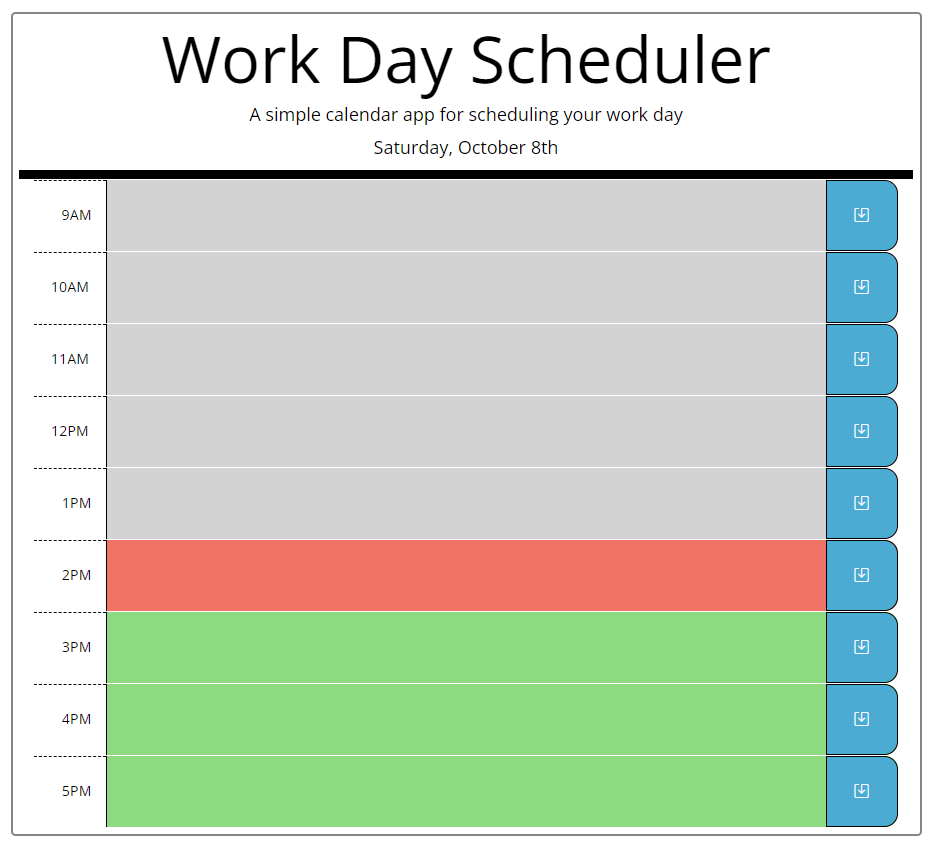

# work-day-planner-api
This api functions as a day planner to organize your busy schedule! 

## Description
This api functions as a day planner to organize your busy schedule! Input your meetings and appointments in the appropriate time block and click the save button! The color coded time blocks also allow the user to easily see the current time.
Gray boxes will show past time, red for the current hour and green for future time. 

Link to live page: https://petechicchetti.github.io/work-day-planner-api/

